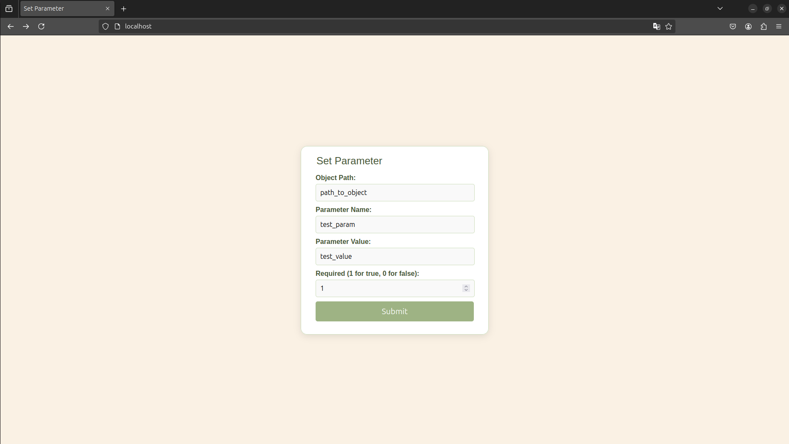
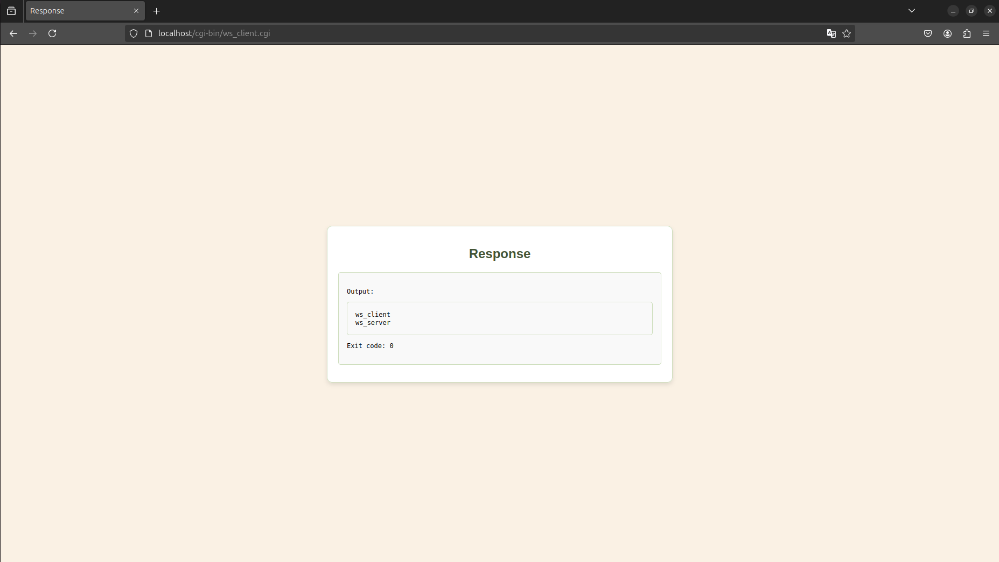

# Web Application For Router Configuration

This program demonstrates a WebSocket client-server communication setup using C programming language. The client sends messages encoded with Protocol Buffers to a WebSocket server, which then processes and responds to these messages.
Note: This project uses https://github.com/protobuf-c/protobuf-c for Protocol Buffers integration and TR-181 Device Data Model for CWMP Endpoints and USP Agents made by BroadBand https://device-data-model.broadband-forum.org/

## Folder Structure

- `src/`: Contains all the source files for the WebSocket client and server.
  - `include/`: Header files, including `protobuf_handler.h`, `wss_handler.h`, and `usp-msg-1-3.pb-c.h`.
  - `protobuf_handler.c`: Implements functions for creating Protocol Buffers messages.
  - `wss_handler.c`: Handles WebSocket operations using libcurl and libwebsockets.
  - `ws_client_main.c`: Main program for the WebSocket client.
  - `ws_server_main.c`: Main program for the WebSocket server.
  - `usp-msg-1-3.pb-c.c`: Implements Protocol Buffers message handling. https://github.com/protobuf-c/protobuf-c/blob/master/protobuf-c/protobuf-c.proto Used hash: "7df109917a2a9d25a23c9e3055bdedc444fa2b36"
- `build/`: Directory where the executable binaries (`ws_client` and `ws_server`) are generated.
- `html/`: Contains `index.html` for a basic web interface to interact with the WebSocket client.

## Installation and Running

### Building the Project

1. Clone the repository:

   ```bash
   $ git clone <repository-url>
   $ cd <repository-directory>
   ```

2. Build the WebSocket Client and Server:

   ```bash
   $ make
   ```

### Running the WebSocket Server

Start the WebSocket server:

```bash
$ cd build
$ ./ws_server <port>
```

This starts the WebSocket server on the specified port, for example, 8080.

### Deploying and Using the WebSocket Client

After building, install the WebSocket client to a CGI directory for web deployment:

```bash
$ sudo make install
```

This command copies the compiled client (`ws_client.cgi`) to `/var/www/html/cgi-bin`.

Place the HTML interface (`index.html`) in your web server's document root (`/var/www/html`).

## Help and Running Parameters

To run the WebSocket client, use the following command format:

```bash
$ ./build/ws_client <method_type> obj_path=<path>&param=<param_val>&value=<value>&required=<is_required>
```

### Parameters:

- `<method_type>`: Specifies the HTTP method for sending data. It should be either `GET` or `POST`.
- `<path>`: Path to the object on the server.
- `<param_val>`: Parameter to be passed to the server.
- `<value>`: Value associated with the parameter.
- `<is_required>`: Indicates whether the parameter is required. Use `1` for true, `0` for false.

### Example

```bash
./ws_client GET obj_path=/devices/1&param=temperature&value=25&required=1
```

### Troubleshooting

- Ensure all dependencies (`libcurl`, `libprotobuf-c`, `libwebsockets`) are installed and accessible to the build environment.
- Check permissions if encountering issues with file operations or web server integration.

## Makefile Commands

- `make`: Compiles both `ws_client` and `ws_server`.
- `make install`: Installs `ws_client` as a CGI script and copies `index.html` to a web directory.

## Demo




